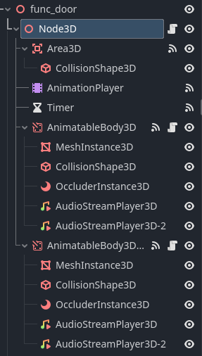
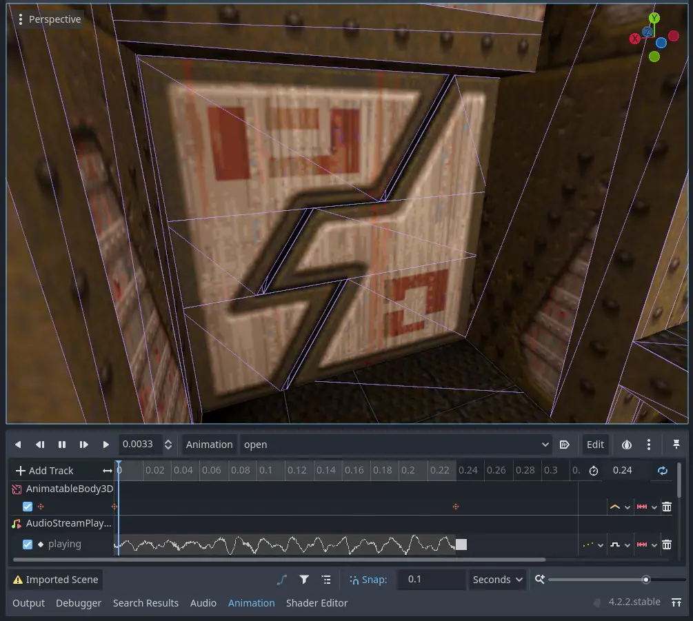
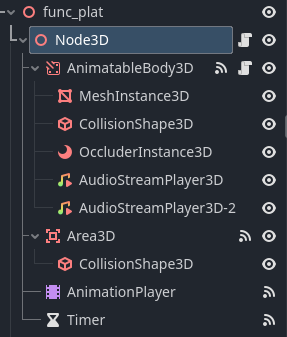
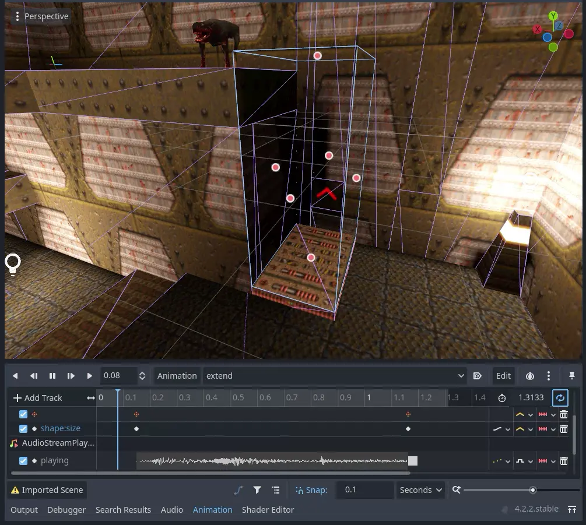
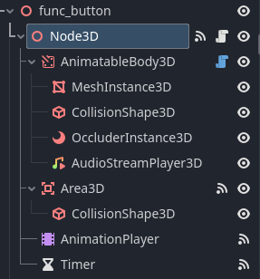
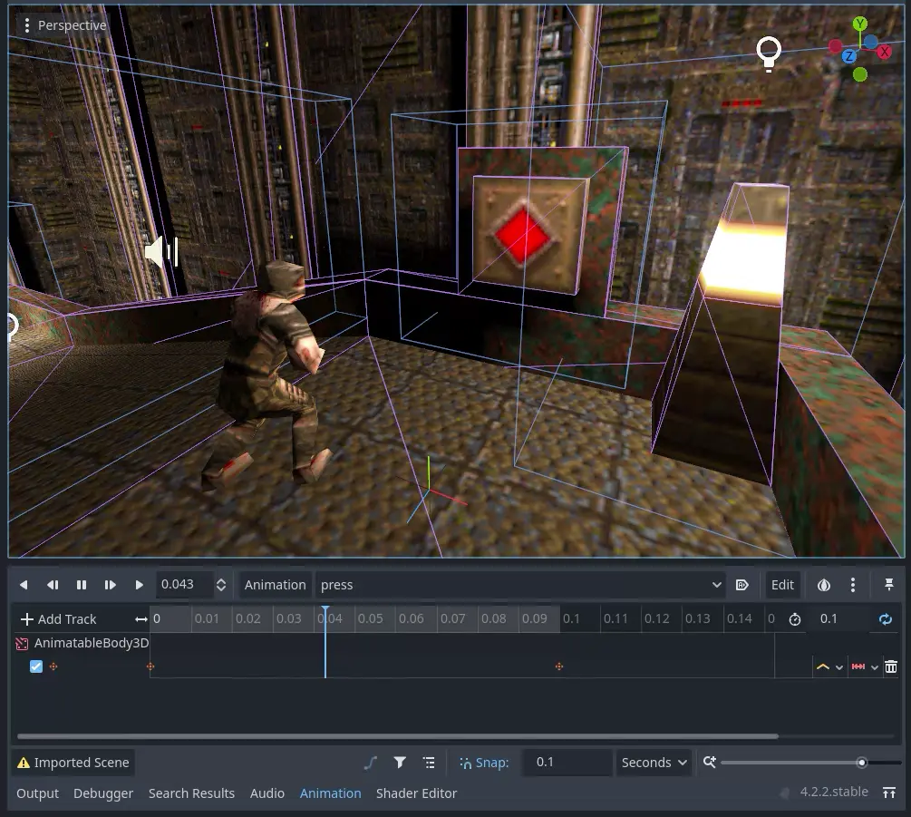

# Quake game profile for [godot-mapper](https://github.com/ELF32bit/godot-mapper) plugin [WIP]

Collision layers driven Quake entities. 

* Door linking is implemented.
* Platforms and doors can crush characters.
* Liquid areas use high precision camera detection.
* Animation states are stored inside a map.
* Most spawnflags are supported.

Change **layers.gd** file to integrate entities into your project.
> This repository needs a lot more work, better use it as a reference.

## Generated scene tree examples
|Scene Tree|func_door|
|:-:|:-:|
|||

|Scene Tree|func_plat|
|:-:|:-:|
|||

|Scene Tree|func_button|
|:-:|:-:|
|||