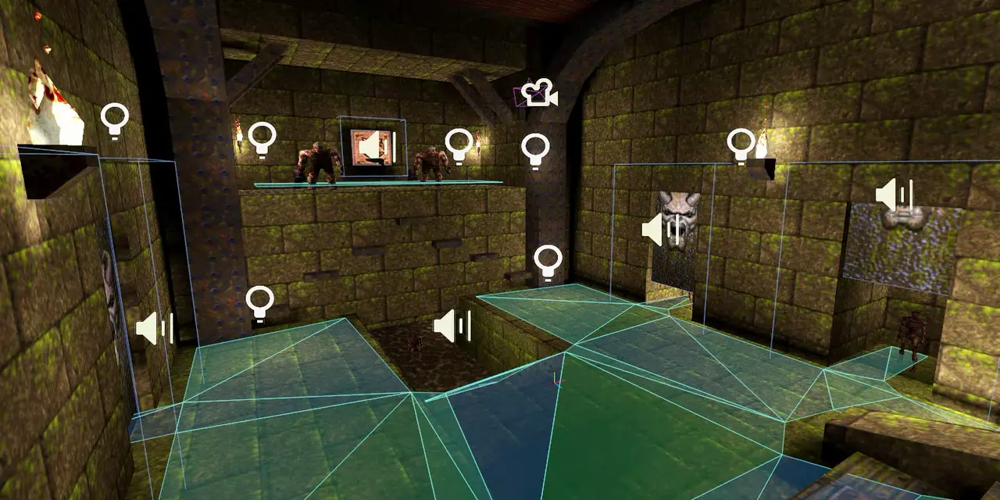

# Quake game profile for [godot-mapper](https://github.com/ELF32bit/godot-mapper) plugin

Collision layers driven Quake entities with generic methods. 
Refer to the entity implementation table for the list of methods. 
Change **layers.gd** file to integrate entities into an existing project. 

> This repository needs a lot more work, better use it as a reference for now.

## Features
* Door linking is implemented.
* Platforms and doors can crush characters.
* Liquid areas use high precision camera detection.
* Animation states are stored inside a map.
* Most spawnflags are supported.

## Entity implementation table

State | Classname | Commentary
-- | ---------------------- | ----------------------------------------------------------- |
✏️ | worldspawn             | CD tracks 2-11 are not included for the `sounds` property.  World environment (sunlight and fog) needs more work. **Liquid areas call `set_distortion_effect`.**
✅ | info_*                 | Does not implement `progs.dat` hacks.
✏️ | item_*                 | Can't be picked up.
✏️ | weapon_*               | Can't be picked up.
✅ | light_*                | No light flickering.
✅ | monster_*              | Enemy AI is beyond the scope of this project.
✅ | ambient_*              |
✅ | func_door              | **Might be driven by `health` property.** **Calls `crush` method on characters and collision objects.**
✏️ | func_door_secret       | Game script is not implemented. Uses wrong default sounds.
✅ | func_wall              | Uses extended alternative texture system.
✅ | func_button            | **Might be driven by `health` property.**
✅ | func_train             | **Calls `crush` method on characters and collision objects.**
✅ | func_plat              | **Calls `crush` method on characters and collision objects.**
✅ | func_illusionary       |
❌ | func_episodegate       | Unnecessary story entity.
❌ | func_bossgate          | Unnecessary story entity.
✅ | trigger_changelevel    | Does not change current `map`.
✅ | trigger_once           | **Might be driven by `health` property.**
❌ | trigger_multiple       | **Will be driven by `health` property.**
❌ | trigger_onlyregistered | Game script is not implemented.
❌ | trigger_secret         | Game script is not implemented.
✅ | trigger_teleport       | **Calls `push` method on a collision object.**
❌ | trigger_setskill       | Game script is not implemented.
✅ | trigger_relay          | Does not print `message`.
❌ | trigger_monsterjump    | **Will require method on a character.**
✅ | trigger_counter        | Does not print `message`.
✅ | trigger_push           | **Calls `push` method on a collision object.**
❌ | trigger_hurt           | **Will require method on a character.**
✏️ | air_bubbles            | Uses placeholder particle system.
✏️ | event_lightning        | Uses placeholder particle system.
✅ | misc_explobox*         | Does not have script to explode.
✏️ | misc_fireball          | Does not move or deal damage.
✅ | misc_noisemaker        |
✅ | path_corner            |
✅ | testplayerstart        |
❌ |trap_shooter            | **Will require method on a character.**
❌ |trap_spikeshooter       | **Will require method on a character.**
✅ | viewthing              |